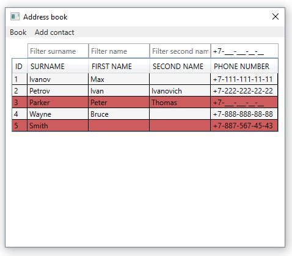

# Address book
This repo contains .NET6 project of address book.  
 
User can: 
-adding contact; 
-saving in XML-file and openning books; 
-deleting and editing contacts by mouse right click; 
-filtering contacts by fields.  

If you added incorrect data (surname and name must be at least 2 and not more than 50 characters, phone number must be filled), this contact will be highlighted. 

## Clone:

Clone this repo to your local machine using: https://github.com/MaxIvanov8/AddressBook

## Stack technologies

**Framework:** .NET 6.0, WPF.  
**Packages:**
- MvvmLight 5.4.1.1;
- Extended.Wpf.Toolkit 4.2.0;
- PropertyChanged.Fody 3.4.0.

Project using MVVM-pattern.

## Prerequisites

Have Visual Studio 2022 or newer installed.

## Verify Installation

You can verify the project builds correctly from Visual Studio using Build -> Build Solution.

## Translations

This project can be translated into Russian.

## Support

If you are having issues, please let me know.

## Author

MaxIvanov: https://github.com/MaxIvanov8
